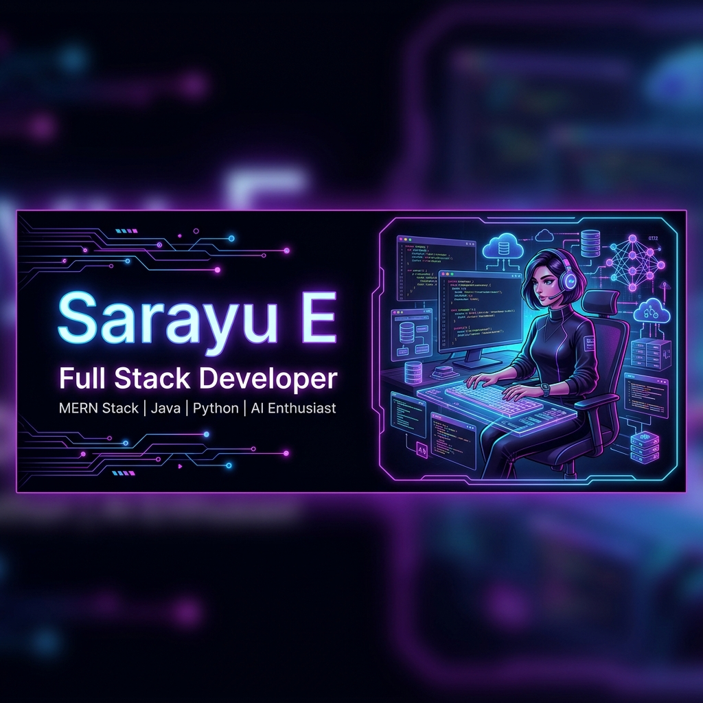

<!-- GITHUB PROFILE BANNER -->

 

<!-- TYPING INTRO & CORE BADGES -->

  <!-- Animated Typing SVG -->
  

  <!-- Professional Badges -->
  

    
    
    
    
  

  

    <a href="#🚀-featured-projects">📂 Explore Projects</a> • 
    <a href="#💡-tech-stack">🛠️ View Skills</a> • 
    <a href="#🌐-connect-with-me">🌐 Get in Touch</a>
  

  

 

<!-- ABOUT ME SECTION -->
## 👩‍💻 About Me

  <table width="95%" style="border-collapse: collapse; border: 1px solid #9B5DE5; border-radius: 8px; background-color: #08090D;">
    <tr>
      <td style="padding: 20px;">
        <h3>Hi, I'm Sarayu E 👋</h3>
        

          I'm a <b>Full Stack Developer</b> passionate about building scalable web applications, AI solutions, and innovative software products.
        

        

          Currently pursuing my <b>B.Tech in Computer Science and Business Systems (CSBS)</b> at VSB Engineering College, Karur. I bridge strategic business architectures with core computational logic, specializing in backend architectures, deep learning model deployments, and secure cryptographic validation workflows.
        

      </td>
    </tr>
  </table>

---

<!-- TECH STACK SECTION -->
## 💡 Tech Stack

<table width="100%">
  <tr>
    <!-- Frontend -->
    <td width="33%" valign="top">
      <h4>🎨 Frontend</h4>
       
       
       
       
      
    </td>
    <!-- Backend -->
    <td width="33%" valign="top">
      <h4>⚙️ Backend</h4>
       
       
       
       
      
    </td>
    <!-- Databases & Tools -->
    <td width="34%" valign="top">
      <h4>🗄️ Databases & Tools</h4>
       
       
       
       
       
      
    </td>
  </tr>
  <tr>
    <!-- AI -->
    <td colspan="3" valign="top">
       
      <h4>🤖 Artificial Intelligence</h4>
      
      
      
      
    </td>
  </tr>
</table>

---

<!-- PROJECTS SECTION -->
## 🚀 Featured Projects

<table width="100%">
  <!-- Project 1 -->
  <tr>
    <td width="50%" valign="top">
      <h3>🔗 BlockCred</h3>
      
<b>Blockchain-Based Skill Credential Verification System</b>

      
A secure decentralized protocol leveraging Ethereum smart contracts to issue, store, and verify academic achievements and credentials, eliminating qualification forgery.

      

        <kbd>Blockchain</kbd> <kbd>Solidity</kbd> <kbd>Web3.js</kbd> <kbd>Ethereum</kbd>
      

    </td>
    <!-- Project 2 -->
    <td width="50%" valign="top">
      <h3>👁️ VisionGuard AI</h3>
      
<b>AI-Based Driver Alertness Monitoring System</b>

      
A real-time deep learning computer vision model tracking driver gaze metrics and eye closing intervals to predict attention lapses and alert driving operators instantly.

      

        <kbd>Computer Vision</kbd> <kbd>Python</kbd> <kbd>TensorFlow</kbd> <kbd>OpenCV</kbd>
      

    </td>
  </tr>
  
  <!-- Project 3 -->
  <tr>
    <td width="50%" valign="top">
      <h3>📄 Resume Screening System</h3>
      
<b>AI-Powered Resume Analyzer</b>

      
An automation pipeline built on Flask and Gemini AI that parses candidate resumes, indexes skill matches against job requirements, and stores analytics in MongoDB.

      

        <kbd>Gemini AI</kbd> <kbd>Flask</kbd> <kbd>MongoDB</kbd> <kbd>NLP</kbd>
      

    </td>
    <!-- Project 4 -->
    <td width="50%" valign="top">
      <h3>💵 Weekend Allowance Management System</h3>
      
<b>Full Stack Expense Ledger with AI Chatbot</b>

      
An accounting portal with role-based dashboard views mapping weekly spending limits and budgets, accompanied by an AI agent assisting in financial advice.

      

        <kbd>Node.js</kbd> <kbd>React</kbd> <kbd>MySQL</kbd> <kbd>AI Chatbot</kbd>
      

    </td>
  </tr>
</table>

---

<!-- ACHIEVEMENTS SECTION -->
## 🏆 Achievements & Extracurriculars

- 🥊 **Boxing & Athletics**: District-level Boxing Winner, State-level Boxing Participant, and selected for University-level selection trials.
- 💡 **Hackathons**: Actively participated in technical coding hackathons, building and pitching Web3 and AI prototypes.
- 🎨 **Leadership**: Founder and Choreographer of **Bright Dance Company**, managing performance lineups, event coordination, and budgeting.

---

<!-- GITHUB ANALYTICS SECTION -->
## 📊 GitHub Analytics

  <table border="0">
    <tr>
      <td align="center" valign="top">
        
      </td>
      <td align="center" valign="top">
        
      </td>
    </tr>
    <tr>
      <td colspan="2" align="center">
         
        
      </td>
    </tr>
  </table>

---

<!-- CONTACT SECTION -->
## 🌐 Connect With Me

  
  
  

 

---

  Designed with 💜 by Antigravity for Sarayu E

