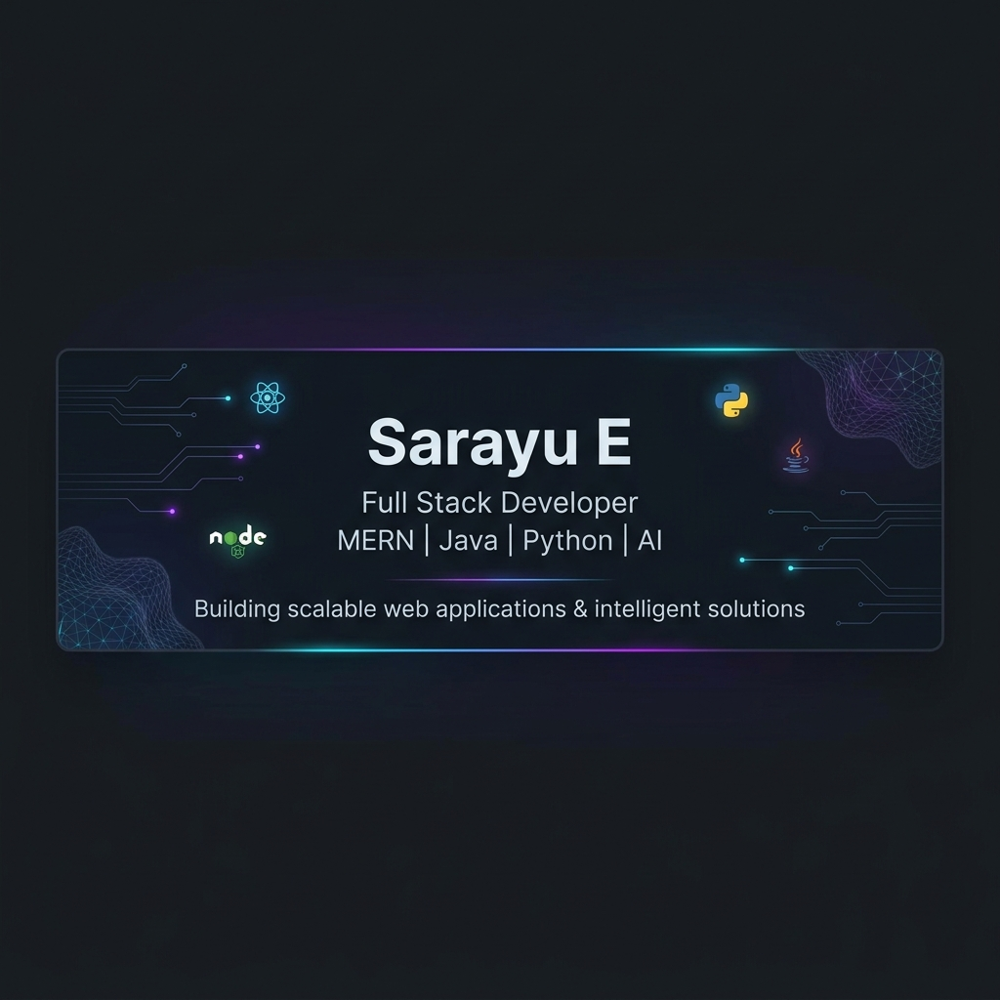

<!-- GITHUB PROFILE BANNER -->

 

<!-- ABOVE THE FOLD PANEL -->

  <!-- Centered Avatar -->
  

    

  <!-- Name and Title -->
  <h1 align="center" style="margin-bottom: 5px;">Sarayu E</h1>
  
Full Stack Developer | MERN Stack | Java | Python | AI Enthusiast

  <!-- Quick Badges -->
  

    
    
    
    
  

  <!-- Short Summary -->
  

    B.Tech Computer Science and Business Systems (CSBS) student and Full Stack Developer. 
    Building secure, intelligent, and scalable digital solutions utilizing modern web engineering and AI.
  

  <!-- Followers & Profile Views -->
  

    
    
  

  <!-- CTA Button -->
  

    
  

  

 

<!-- ABOUT ME SECTION -->
## 👩‍💻 About Me

I am a focused **B.Tech Computer Science and Business Systems (CSBS)** student at **VSB Engineering College, Karur**, and a passionate **Full Stack Developer**. I combine backend architecture logic with strategic business operations to build secure, robust applications. 

- 🎓 **Major:** B.Tech – Computer Science and Business Systems
- 💡 **Interests:** MERN Stack, Java Development, Python Programming, Artificial Intelligence, Blockchain Protocols, and Modern Web Development.
- 🥊 **Fun Fact:** When I'm not writing loops, I'm throwing jabs! I'm a competitive boxer and the founder of **Bright Dance Company**.

---

<!-- TECHNICAL SKILLS SECTION -->
## 💡 Technical Skills

<table width="100%">
  <tr>
    <td width="50%" valign="top">
      <h4>🎨 Frontend Development</h4>
      <ul>
        <li>HTML5 & CSS3</li>
        <li>JavaScript (ES6+)</li>
        <li>React.js</li>
        <li>Tailwind CSS</li>
        <li>Figma (UI/UX prototyping)</li>
      </ul>
    </td>
    <td width="50%" valign="top">
      <h4>⚙️ Backend & Frameworks</h4>
      <ul>
        <li>Java / Spring Boot</li>
        <li>Node.js / Express.js</li>
        <li>Python / Flask</li>
      </ul>
    </td>
  </tr>
  <tr>
    <td width="50%" valign="top">
      <h4>🗄️ Database Management</h4>
      <ul>
        <li>MongoDB (NoSQL)</li>
        <li>MySQL (SQL)</li>
      </ul>
    </td>
    <td width="50%" valign="top">
      <h4>💻 Programming Languages</h4>
      <ul>
        <li>Java (OOP & Systems)</li>
        <li>Python (Automation & ML)</li>
        <li>C Language</li>
      </ul>
    </td>
  </tr>
  <tr>
    <td width="50%" valign="top">
      <h4>🤖 Artificial Intelligence & ML</h4>
      <ul>
        <li>Machine Learning Algorithms</li>
        <li>Generative AI Systems</li>
        <li>Gemini API Integrations</li>
      </ul>
    </td>
    <td width="50%" valign="top">
      <h4>🛠️ Tools & Cloud Platforms</h4>
      <ul>
        <li>Git / GitHub</li>
        <li>Docker (Basics)</li>
        <li>AWS (Amazon Web Services Basics)</li>
      </ul>
    </td>
  </tr>
</table>

---

<!-- FEATURED PROJECTS SECTION -->
## 🚀 Featured Projects

<table width="100%">
  <!-- Project 1 -->
  <tr>
    <td width="50%" valign="top">
      <h3>🔗 BlockCred</h3>
      
<b>Blockchain-Based Skill Credential Verification System</b>

      
A secure, decentralized solution utilizing Solidity smart contracts to issue, archive, and instantly verify academic credentials and skills, eliminating credential fraud.

      

        
        
      

    </td>
    <!-- Project 2 -->
    <td width="50%" valign="top">
      <h3>👁️ VisionGuard AI</h3>
      
<b>AI-Based Driver Alertness and Safety Monitoring System</b>

      
An intelligent computer vision model that tracks eye closing durations and facial features in real-time, predicting driver fatigue to trigger instant auditory warning alarms.

      

        
        
      

    </td>
  </tr>
  
  <!-- Project 3 -->
  <tr>
    <td width="50%" valign="top">
      <h3>📄 Resume Screening System</h3>
      
<b>AI-Powered Resume Analysis</b>

      
A Flask web portal running Gemini LLM services to parse candidates' resumes, rank competency against job descriptions, and store evaluations inside MongoDB.

      

        
        
        
      

    </td>
    <!-- Project 4 -->
    <td width="50%" valign="top">
      <h3>💵 Weekend Allowance Management System</h3>
      
<b>Role-Based Financial Tracker with AI Chatbot</b>

      
An automated ledger system mapping budget lines and transactions with an embedded AI assistant to answer user questions on savings optimizations.

      

        
        
        
      

    </td>
  </tr>
</table>

---

<!-- ACHIEVEMENTS SECTION -->
## 🏆 Achievements

<table width="100%">
  <tr>
    <td width="33%" valign="top">
      <h4>🥊 Boxing Achievements</h4>
      <ul>
        <li>🥇 <b>District-Level Winner</b></li>
        <li>🎖️ <b>State-Level Participant</b></li>
        <li>🎓 <b>University-Level Selection</b></li>
      </ul>
    </td>
    <td width="33%" valign="top">
      <h4>💡 Hackathons</h4>
      <ul>
        <li>🚀 Active participant in national hackathons</li>
        <li>💻 Innovating prototype models combining Blockchain & Web3</li>
      </ul>
    </td>
    <td width="34%" valign="top">
      <h4>⚙️ Technical Leadership</h4>
      <ul>
        <li>👑 <b>Founder @ Bright Dance Company</b></li>
        <li>📦 Deployed 5+ end-to-end full-stack software applications</li>
      </ul>
    </td>
  </tr>
</table>

---

<!-- GITHUB ANALYTICS SECTION -->
## 📊 GitHub Analytics

  <table border="0">
    <tr>
      <td align="center" valign="top">
        
      </td>
      <td align="center" valign="top">
        
      </td>
    </tr>
    <tr>
      <td colspan="2" align="center">
         
        
      </td>
    </tr>
  </table>

---

<!-- CONTACT SECTION -->
## 🌐 Connect With Me

  
  
  

 

---

  Designed with 💜 by Antigravity for Sarayu E

